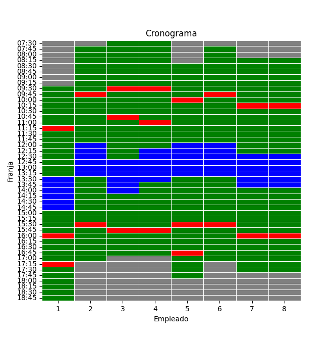
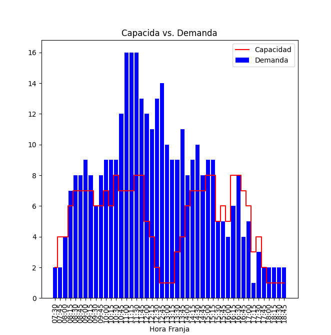
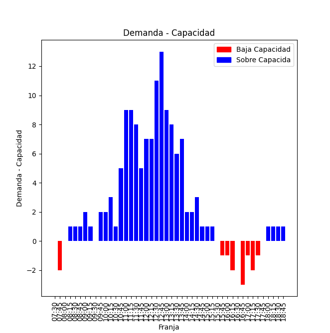

# dataton2023-optilab


## Installation

Clone the respository and install 


```
git clone https://github.com/optilab-mzl/dataton2023-optilab.git
```
```
cd dataton2023-optilab
```

```
pip install . 
```


## Generate Schedule  CLI

You can use the command-line interface (CLI) to generate a schedule from an Excel file. The command to do this is as follows:

```
get_schedule <excel_path> <output_path>
```


## Python API


### Generate Schedule 
```
from dataton2023_optilab.engine import get_schedule
import pandas as pd 

df_demanda = pd.read_excel("excel.xlsx", sheet_name="demand")
df_workers = pd.read_excel("excel.xlsx", sheet_name="workers")
get_schedule(df_demanda, df_workers, "out.csv")
```


### Visualizations

* Plot schedule 

    ```
    from dataton2023_optilab.utils.plot import schedule
    import pandas as pd 

    df_schedule = pd.read_csv("schedule.csv")
    schedule(df_schedule)
    ```
    <figure  align="center">
     
    <figcaption>Schedule</figcaption>
    </figure>


* Plot Capacida vs Damanda 

    ```
    from dataton2023_optilab.utils.plot import capacidad_vs_demanda
    import pandas as pd 

    df_schedule = pd.read_csv("schedule.csv")
    df_demand = pd.read_excel("excel.xlsx", sheet_name="demand")


    capacidad_vs_demanda(df_schedule, df_demand)
    ```

    <figure  align="center">
     
    <figcaption>Capacida vs Damanda</figcaption>
    </figure>


* Plot Diff Capacidad vs Demanda

    ```
    from dataton2023_optilab.utils.plot import diff_capacidad_vs_demanda
    import pandas as pd 

    df_schedule = pd.read_csv("schedule.csv")
    df_demand = pd.read_excel("excel.xlsx", sheet_name="demand")


    diff_capacidad_vs_demanda(df_schudel, df_demand)

    ```

    <figure  align="center">
     
    <figcaption>Diff</figcaption>
    </figure>