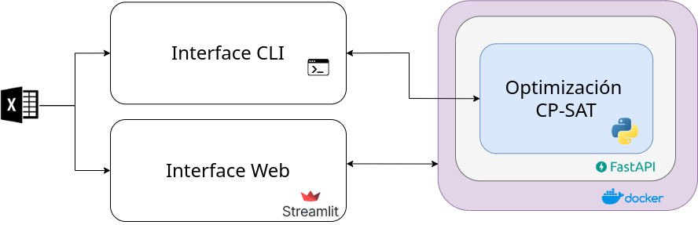

<p align="center">
   
</p>


<h1 align="center"> Optimal Scheduling Program</h1>


## Motivación 

Bancolombia, una de las entidades financieras más prominentes del país, tiene un firme compromiso de mejorar significativamente la calidad de su servicio al cliente. En este empeño, la toma de decisiones basada en datos se erige como una de sus herramientas clave para alcanzar este objetivo. La analítica desempeña un papel fundamental en la obtención de una visión más precisa de las interacciones entre los clientes y el banco, convirtiéndose en el pilar fundamental de nuestra estrategia. 

Como parte esencial de su compromiso en la mejora de la experiencia del usuario, Bancolombia busca optimizar la cantidad de asesores en función de la demanda, garantizando al mismo tiempo horarios adecuados para el bienestar de su personal. Para lograr este objetivo, es imprescindible programar las jornadas laborales de los asesores de manera que se pueda ofrecer la mejor atención, asegurando la disponibilidad óptima de asesores para satisfacer la demanda de la manera más efectiva posible.


## Instalación

### Clone el repositorio:  

Para comenzar, clona este repositorio en tu máquina local utilizando los siguientes comandos:

```
$ git clone https://github.com/optilab-mzl/dataton2023-optilab.git
```

```
$ cd dataton2023-optilab
```

Es posible interactuar con la solución desarrollada de dos maneras: vía linea de comandos (CLI) o mediante interface web. Teniendo en cuenta la forma de evaluación en el criterio de eficiencia, se pide que se use la línea de comandos o CLI. A continuación se explica cada uno de ellos. 


### Instalación como Paquete de Python (Interface CLI)


Puedes instalar la herramienta como un paquete de Python utilizando pip:

```
$ pip install src/backend
```

Una vez instalado, puedes generar horarios ejecutando el siguiente comando:

```
$ get_schedule <ruta_excel> <ruta_salida>
```
Asegúrate de reemplazar <ruta_excel> con la ubicación de tu archivo Excel y <ruta_salida> con la ruta de salida deseada. Por ejemplo: 

```
$ get_schedule /home/Downloads/demanda.xlsx /home/output.csv
```


Si requiere ayuda puede usar la opción de ayuda

```
$ get_schedule --help

Genera un horario de trabajadores basado en la demanda.

Usage:
  get_schedule <ruta_excel> <ruta_salida> [--time_seconds=<time_seconds>] [--workers=<workers>]

Arguments:
  <ruta_excel>      Ruta al archivo Excel que contiene los datos de la demanda y los trabajadores.
  <ruta_salida>     Ruta para el archivo CSV de salida.

Options:
  --time_seconds=<time_seconds>    Tiempo en segundo para cada sucursal para terminar el proceso de búsqueda [default: 380]
  --workers=<workers>              Número de workers para usar búsqueda paralela [default: cpu_count]
  -h, --ayuda                      Muestra este mensaje de ayuda y sale.

```

### Instalación con Docker (Interface GUI)

```

```

## Características 

- Capacidad de escalamiento horizontal y vertical.
- Código abierto.
- Aprovechamiento total de los recursos de procesamiento disponibles.

## Workflow

## Recomendaciones 

### Definición de las entradas

El archivo de entrada debe ser excel que tenga dos hojas demand y workers descritas a continuación:

demand

<center>

| Columna    | Descripción             |
|------------|-------------------------|
| suc_cod    | Código de la sucursal   |
| fecha_hora | Franja horaria          |
| demanda    | Demanda estimada        |

</center>

workers

<center>

|   Columna   |         Descripción         |
| ----------- | --------------------------- |
|   suc_cod   | Código de la sucursal       |
|  documento  | Código de identificación    |
|  contrato   | Tipo de contrato            |

</center>

### Definición de las salidas

La salida es un archivo csv con los siguientes campos 

<center>

|   Columna   |         Descripción         |
| ----------- | --------------------------- |
|  hora_franja   | Número de franja       |
|  estado  | Estado del empleado    |
|  documento   | Documento del empleado            |
|  fecha   | Fecha           |
|  hora   | Hora            |
|   suc_cod   | Código de la sucursal       |

</center>


## Estructura del repositorio 

## Arquitectura del sistema

El sistema está compuesto por dos componentes principales: el frontend desarrollado usando Streamlit y el backend de optimización desarrollado usando cp-sat como librería de optimización. 

<p align="center">
  <figure align="center">
   
  <figcaption>Arquitectura del sistema</figcaption>
  </figure>
</p>

Cada uno de estos componentes esta doquerizado, lo que facilita, principalmente al modulo de optimización, tener un escalamiento tanto vertical como horizontal. 


# Solución del problema de optimización

### Definición del problema

Bancolombia está interesado en mejorar la programación horaria SEMANAL de los empleados de caja de 5 sucursales. Los empleados pueden estar en 4 estados:

1. **Trabaja**: El empleado esta disponible para atender clientes.
2. **Pausa Activa**: El empleado no esta disponible para atender clientes.
3. **Almuerza**: El empleado esta tomando su tiempo de almuerzo (no disponible para atender <ruta_salida>clientes)
4. **Nada**: El empleado no ha comenzado su jornada laboral o ya la termino.

**El objetivo del ejercicio es definir en qué estado se encuentra cada uno de los empleados en franjas horarias de 15 minutos con el fin de minimizar la diferencia existente entre la cantidad de empleados trabajando y la demanda de empleados requerida para cada franja horaria cuando la demanda es mayor a la capacidad**. Estas demandas se tienen para cada una de las franjas para todos los días de una semana de lunes a sábado.

A continuación, se brindan los detalles más relevantes del problema:

Los empleados tienen distintos tipos de contrato: (i) Tiempo Completo (TC), y (ii) Medio Tiempo (MT). De acuerdo con el tipo de contrato se tienen distintas restricciones. Por ejemplo, la jornada laboral de los empleados depende de su tipo de contrato. La tabla a continuación describe los tiempos de la jornada laboral.

<center>

| Tipo de contrato     | Lunes a viernes    | Sábado   |
|----------------------|--------------------|----------|
| Tiempo Completo (TC) | 7 horas diarias    | 5 horas  |
| Medio Tiempo (MT)    | 4 horas diarias    | 4 horas  |

</center>

Nota: Los estados de Trabaja y Pausa Activa hacen parte de la jornada laboral. El tiempo de almuerzo NO constituye tiempo de jornada laboral.

Únicamente los empleados con tipo de contrato TC deben tomar el tiempo de almuerzo de forma CONTINUA los días entre semana (lunes a viernes). Este tiempo es de 1 hora y media.

La hora mínima de salida para tomar el almuerzo son las 11:30 am y la hora máxima para salir a tomar el almuerzo es a la 1:30 pm. Esto quiere decir que:

1. Una persona NO puede salir a tomar almuerzo a las 11:15 am
2. Una persona NO puede salir a tomar almuerzo a la 1:45 pm
3. Es VÁLIDO que una persona tome almuerzo de la 1:30 pm a las 3:00 pm

Nota: El sábado NO se programa tiempo de almuerzo para NINGÚN empleado.

Cualquier franja de trabajo debe durar entre 1 y 2 horas.

Los empleados con tipo de contrato MT NO se les programa almuerzo ningún día.

Todos los empleados deben comenzar su jornada laboral los días entre semana (lunes a viernes) entre las 7:30 am y 4:30 pm. Y los sábados deben iniciar su jornada laboral entre las 7:30 am y las 11:00 am.

Para los días entre semana (lunes a viernes) a los empleados de TC se les debe mantener constante: (i) la hora a la que inicio y fin de la jornada laboral, y (ii) el tiempo de almuerzo. Las Pausas Activas si pueden tomarse en diferentes horarios en distintos días.

Para los días entre semana (lunes a viernes) a los empleados de MT se les debe mantener constante la hora a la que inicio y fin de la jornada laboral. Las Pausas Activas si pueden tomarse en diferentes horarios en distintos días.

Los sábados los horarios de todos los empleados puede cambiar.

Todos los empleados deben trabajar mínimo 1 hora de forma continua para poder salir a una Pausa Activa o Almuerzo. Esto quiere decir que, si un empleado solo ha trabajado 3 franjas horarias, en la 4 franja horaria NO debe salir a Pausa Activa o Almuerzo.

Todos los empleados deben trabajar máximo 2 horas de forma continua sin salir a una pausa activa. Esto quiere decir que, si un empleado ha trabajado 8 franjas horarias, en la 9 franja horaria SI debe salir a Pausa Activa o Almuerzo.

Todos los días el horario de los empleados debe ser CONTINUO, desde que comienza la jornada laboral del empleado este solo puede estar en los estados de Trabaja, Pausa Activa y Almuerza (este último solo aplica para empleados de TC entre semana). Es decir, que el estado Nada solo puede estar activo al comienzo del día si el empleado no ha comenzado su jornada laboral o al final del día si el empleado ya completo su jornada laboral.

El último estado todos los días de la jornada laboral de los empleados debe ser Trabaja.

Debe haber por lo menos 1 empleado en el estado Trabaja en cada franja horaria que tenga una demanda mayor o igual a 1.

### Datos 
El archivo `Dataton 2023 Etapa 2.xlsx` tiene dos hojas demand y workers descritas a continuación:

demand

<center>

| Columna    | Descripción             |
|------------|-------------------------|
| suc_cod    | Código de la sucursal   |
| fecha_hora | Franja horaria          |
| demanda    | Demanda estimada        |

</center>

workers

<center>

|   Columna   |         Descripción         |
| ----------- | --------------------------- |
|   suc_cod   | Código de la sucursal       |
|  documento  | Código de identificación    |
|  contrato   | Tipo de contrato            |

</center>

## Solución al problema

A continuación se detalla la estrategia adoptada para resolver el problema presentado, considerando su complejidad combinatoria debido a las variadas posibilidades de asignación de horarios de trabajo.

### Aplicación de la Programación con Restricciones

Debido a la naturaleza combinatoria del problema, que implica múltiples combinaciones de posibles horarios de trabajo, se optó por utilizar técnicas de programación con restricciones, conocidas como [Constraint Programming (CP)](https://en.wikipedia.org/wiki/Constraint_programming). El CP es un paradigma ampliamente utilizado para resolver problemas combinatorios, que se basa en una variedad de técnicas provenientes de la inteligencia artificial, la informática y la investigación de operaciones.

El enfoque de CP se centra en identificar soluciones factibles mediante la búsqueda en un espacio de posibilidades, aunque también puede integrarse con algoritmos de optimización para hallar la solución óptima.


### Metodología 


#### Modelo de optimización 

La formulación matemática del problema es la siguiente:

$$
\begin{align*}
\mathbf{P}^* = \arg \min_{\mathbf{P}} \sum_d \sum_f \max(0, \mathbf{D}_{d,f}- \sum_t \mathbf{P} ^{+} _{t,d,f})
\\
\text{Sujeto a } C_1(\mathbf{P}) \land C_2(\mathbf{P}) \land \dots \land  C_n(\mathbf{P})
\end{align*}
$$ 


Donde:

- $\mathbf{P} \in \{0,1\}^{N_t \times N_d \times N_f \times N_e}$: Matriz booleana que con tiene todo las posibles combinaciones de trabajadores, dias, franjas y estados.
- $\mathbf{P}⁺ \in \{0,1\}^{N_t \times N_d \times N_f}$: Matriz booleana que con tiene todo las posibles combinaciones de trabajadores, dias, franjas y solo el estado "Trabaja".
- $\mathbf{D} \in \mathbb{Z}^{N_d \times N_f}$ : Demanda en cada dìa y franja de la semana.
- $d$ : Día de la semana.
- $f$ : Franja del día.
- $t$ : Trabajador.
- $C_i$ : Es la i-jésima restricción asociada al problema.

Las restricciones $\{ C_1, C_2, \dots,C_n \}$ son las definidas dentro del problema además de otras restricciones que surgen del entendimiento de la dinámica de los horarios de trabajo y de la forma enq ue se planteó el problema, que puede ayudan a resolver el problema con mayor facilidad. 

#### Técnica usada para solucionar el problema 

Para la resolución de este problema se ha utilizado [CP-SAT](https://developers.google.com/optimization/cp/cp_solver) de Google, la cual es de código abierto. CP-SAT es una herramienta que combina programación por restricciones con técnicas de satisfacción de restricciones booleanas (SAT). El procedimiento inicia con la definición de las variables de decisión, las restricciones y la función objetivo. Posteriormente, CP-SAT aplica la propagación de restricciones para descartar soluciones no factibles y así reducir el espacio de búsqueda. La búsqueda heurística permite la exploración sistemática de soluciones potenciales, mejorando progresivamente su calidad. Esta herramienta busca optimizar la función objetivo y es capaz de encontrar soluciones óptimas o aproximadas, demostrando ser una solución robusta para la planificación y toma de decisiones en variados contextos.


### Posibles mejoras 

- Reducir el número de variables y restricciones para incrementar la velocidad del algoritmo.

## Referencias


- [Google Ortools - Constraint Optimization](https://developers.google.com/optimization/cp)
- [Using and Understanding ortools' CP-SAT: A Primer and Cheat Sheet](https://github.com/d-krupke/cpsat-primer)

<!--

- Constraint Problem (CP): Problema que tienen restricciones. 
- The Boolean satisfiability problem (SAT)
is the problem of deciding whether there is a variable
assignment that satisfies a given propositional formula.
- SAT: extremely efficient problem with expressivity
- SAT solvers are extremely efficient
- integer programming problems
- CP-SAT solver: A constraint programming solver that uses SAT (satisfiability) method -->