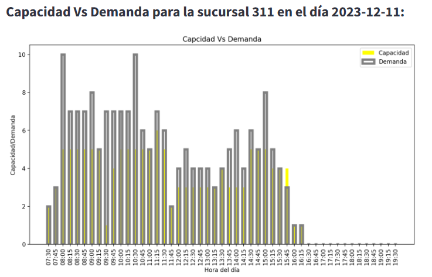

<p align="center">
   
</p>


<h1 align="center"> Optimal Scheduling Program</h1>


<br>
<div align="center">
  


  </div>
  <br>


**Advertencia**: Para la evaluación del criterio de eficiencia por favor diríjase a la sección [Opción de uso 1: Paquete de python - CLI](#opci%C3%B3n-de-uso-1-paquete-de-python---cli)

## Contenido

<!-- TOC -->

- [Contenido](#contenido)
- [Motivación](#motivaci%C3%B3n)
- [Definición del problema](#definici%C3%B3n-del-problema)
    - [Datos](#datos)
- [Solución al problema](#soluci%C3%B3n-al-problema)
    - [Aplicación de la Programación con Restricciones](#aplicaci%C3%B3n-de-la-programaci%C3%B3n-con-restricciones)
    - [Metodología](#metodolog%C3%ADa)
        - [Modelo de optimización](#modelo-de-optimizaci%C3%B3n)
        - [Técnica usada para solucionar el problema](#t%C3%A9cnica-usada-para-solucionar-el-problema)
- [Resultados](#resultados)
- [Arquitectura de la Solución](#arquitectura-de-la-soluci%C3%B3n)
    - [Arquitectura Basada en Consola](#arquitectura-basada-en-consola)
        - [Paquete de Python para Optimización](#paquete-de-python-para-optimizaci%C3%B3n)
        - [Interfaz de Línea de Comandos CLI](#interfaz-de-l%C3%ADnea-de-comandos-cli)
    - [Arquitectura con Interfaz de Usuario](#arquitectura-con-interfaz-de-usuario)
        - [Interfaz Web](#interfaz-web)
        - [REST API](#rest-api)
        - [Despliegue con Docker](#despliegue-con-docker)
- [Características de la Arquitectura](#caracter%C3%ADsticas-de-la-arquitectura)
- [Interface web detallado](#interface-web-detallado)
    - [Workflow](#workflow)
    - [Consideraciones](#consideraciones)
        - [Definición de las entradas](#definici%C3%B3n-de-las-entradas)
        - [Definición de las salidas](#definici%C3%B3n-de-las-salidas)
- [Estructura del Repositorio](#estructura-del-repositorio)
- [Comandos para correr la solución](#comandos-para-correr-la-soluci%C3%B3n)
    - [Prerrequisitos para la Instalación](#prerrequisitos-para-la-instalaci%C3%B3n)
    - [Instrucciones de Instalación](#instrucciones-de-instalaci%C3%B3n)
        - [Clone el repositorio:](#clone-el-repositorio)
        - [Navegar al Directorio del Repositorio](#navegar-al-directorio-del-repositorio)
    - [Opción de uso 1: Paquete de python - CLI](#opci%C3%B3n-de-uso-1-paquete-de-python---cli)
    - [Opción de Uso 2: Instalación con Docker para la FastAPI](#opci%C3%B3n-de-uso-2-instalaci%C3%B3n-con-docker-para-la-fastapi)
        - [Construcción de la Imagen Docker](#construcci%C3%B3n-de-la-imagen-docker)
        - [Verificación de la Imagen Docker](#verificaci%C3%B3n-de-la-imagen-docker)
        - [Ejecución del Contenedor Docker](#ejecuci%C3%B3n-del-contenedor-docker)
        - [Uso de la RestAPI - FastAPI](#uso-de-la-restapi---fastapi)
            - [Estructura JSON para Solicitudes POST](#estructura-json-para-solicitudes-post)
            - [Estructura JSON de la Respuesta](#estructura-json-de-la-respuesta)
        - [Ejemplo de Uso con cURL](#ejemplo-de-uso-con-curl)
    - [Opción de Uso 3: Interface Web - Streamlit](#opci%C3%B3n-de-uso-3-interface-web---streamlit)
- [Referencias](#referencias)

<!-- /TOC -->


## Motivación 

Bancolombia, una de las entidades financieras más prominentes del país, tiene un firme compromiso de mejorar significativamente la calidad de su servicio al cliente. En este empeño, la toma de decisiones basada en datos se erige como una de sus herramientas clave para alcanzar este objetivo. La analítica desempeña un papel fundamental en la obtención de una visión más precisa de las interacciones entre los clientes y el banco, convirtiéndose en el pilar fundamental de su estrategia. 

Como parte esencial de su compromiso en la mejora de la experiencia del usuario, Bancolombia busca optimizar la cantidad de asesores en función de la demanda, garantizando al mismo tiempo horarios adecuados para el bienestar de su personal. Para lograr este objetivo, es imprescindible programar las jornadas laborales de los asesores de manera que se pueda ofrecer la mejor atención, asegurando la disponibilidad óptima de asesores para satisfacer la demanda de la manera más efectiva posible.


## Definición del problema 

Bancolombia está interesado en mejorar la programación horaria SEMANAL de los empleados de caja de 5 sucursales. Los empleados pueden estar en 4 estados:

1. **Trabaja**: El empleado esta disponible para atender clientes.
2. **Pausa Activa**: El empleado no esta disponible para atender clientes.
3. **Almuerza**: El empleado esta tomando su tiempo de almuerzo (no disponible para atender <ruta_salida>clientes)
4. **Nada**: El empleado no ha comenzado su jornada laboral o ya la termino.

**El objetivo del ejercicio es definir en qué estado se encuentra cada uno de los empleados en franjas horarias de 15 minutos con el fin de minimizar la diferencia existente entre la cantidad de empleados trabajando y la demanda de empleados requerida para cada franja horaria cuando la demanda es mayor a la capacidad**. Estas demandas se tienen para cada una de las franjas para todos los días de una semana de lunes a sábado.

A continuación, se brindan los detalles más relevantes del problema:

Los empleados tienen distintos tipos de contrato: (i) Tiempo Completo (TC), y (ii) Medio Tiempo (MT). De acuerdo con el tipo de contrato se tienen distintas restricciones. Por ejemplo, la jornada laboral de los empleados depende de su tipo de contrato. La tabla a continuación describe los tiempos de la jornada laboral.

<center>

| Tipo de contrato     | Lunes a viernes    | Sábado   |
|----------------------|--------------------|----------|
| Tiempo Completo (TC) | 7 horas diarias    | 5 horas  |
| Medio Tiempo (MT)    | 4 horas diarias    | 4 horas  |

</center>

Nota: Los estados de Trabaja y Pausa Activa hacen parte de la jornada laboral. El tiempo de almuerzo NO constituye tiempo de jornada laboral.

Únicamente los empleados con tipo de contrato TC deben tomar el tiempo de almuerzo de forma CONTINUA los días entre semana (lunes a viernes). Este tiempo es de 1 hora y media.

La hora mínima de salida para tomar el almuerzo son las 11:30 am y la hora máxima para salir a tomar el almuerzo es a la 1:30 pm. Esto quiere decir que:

1. Una persona NO puede salir a tomar almuerzo a las 11:15 am
2. Una persona NO puede salir a tomar almuerzo a la 1:45 pm
3. Es VÁLIDO que una persona tome almuerzo de la 1:30 pm a las 3:00 pm

Nota: El sábado NO se programa tiempo de almuerzo para NINGÚN empleado.

Cualquier franja de trabajo debe durar entre 1 y 2 horas.

Los empleados con tipo de contrato MT NO se les programa almuerzo ningún día.

Todos los empleados deben comenzar su jornada laboral los días entre semana (lunes a viernes) entre las 7:30 am y 4:30 pm. Y los sábados deben iniciar su jornada laboral entre las 7:30 am y las 11:00 am.

Para los días entre semana (lunes a viernes) a los empleados de TC se les debe mantener constante: (i) la hora a la que inicio y fin de la jornada laboral, y (ii) el tiempo de almuerzo. Las Pausas Activas si pueden tomarse en diferentes horarios en distintos días.

Para los días entre semana (lunes a viernes) a los empleados de MT se les debe mantener constante la hora a la que inicio y fin de la jornada laboral. Las Pausas Activas si pueden tomarse en diferentes horarios en distintos días.

Los sábados los horarios de todos los empleados puede cambiar.

Todos los empleados deben trabajar mínimo 1 hora de forma continua para poder salir a una Pausa Activa o Almuerzo. Esto quiere decir que, si un empleado solo ha trabajado 3 franjas horarias, en la 4 franja horaria NO debe salir a Pausa Activa o Almuerzo.

Todos los empleados deben trabajar máximo 2 horas de forma continua sin salir a una pausa activa. Esto quiere decir que, si un empleado ha trabajado 8 franjas horarias, en la 9 franja horaria SI debe salir a Pausa Activa o Almuerzo.

Todos los días el horario de los empleados debe ser CONTINUO, desde que comienza la jornada laboral del empleado este solo puede estar en los estados de Trabaja, Pausa Activa y Almuerza (este último solo aplica para empleados de TC entre semana). Es decir, que el estado Nada solo puede estar activo al comienzo del día si el empleado no ha comenzado su jornada laboral o al final del día si el empleado ya completo su jornada laboral.

El último estado todos los días de la jornada laboral de los empleados debe ser Trabaja.

Debe haber por lo menos 1 empleado en el estado Trabaja en cada franja horaria que tenga una demanda mayor o igual a 1.

### Datos 
El archivo `Dataton 2023 Etapa 2.xlsx` tiene dos hojas demand y workers descritas a continuación:

demand

<center>

| Columna    | Descripción             |
|------------|-------------------------|
| suc_cod    | Código de la sucursal   |
| fecha_hora | Franja horaria          |
| demanda    | Demanda estimada        |

</center>

workers

<center>

|   Columna   |         Descripción         |
| ----------- | --------------------------- |
|   suc_cod   | Código de la sucursal       |
|  documento  | Código de identificación    |
|  contrato   | Tipo de contrato            |

</center>


## Solución al problema

A continuación, se expone la estrategia implementada para abordar el desafío planteado, teniendo en cuenta la complejidad combinatoria inherente a la asignación de horarios laborales.

### Aplicación de la Programación con Restricciones

Ante la complejidad combinatoria del problema, caracterizada por la gran cantidad de posibles combinaciones de asignaciones horarias, hemos recurrido a la técnica de Programación con Restriciones ([Constraint Programming][Constraint Programming (CP)](https://en.wikipedia.org/wiki/Constraint_programming), CP). Este paradigma, que encuentra aplicaciones en campos tan diversos como la inteligencia artificial, las ciencias de la computación y la investigación operativa, es particularmente efectivo para problemas de esta naturaleza.

La técnica de CP permite delimitar y explorar el espacio de soluciones factibles, aplicando restricciones que reducen progresivamente las posibilidades hasta identificar las asignaciones válidas. Además, esta metodología puede complementarse con algoritmos de optimización, lo que no solo garantiza encontrar una solución, sino que también busca que esta sea la más óptima dentro del conjunto de posibles soluciones.


### Metodología 

#### Modelo de optimización 

La formulación matemática del problema es la siguiente:

$$
\begin{align*}
\mathbf{P}^* = \arg \min_{\mathbf{P}} \sum_d \sum_f \max(0, \mathbf{D}_{d,f}- \sum_t \mathbf{P} ^{+} _{t,d,f})
\\
\text{Sujeto a } C_1(\mathbf{P}) \land C_2(\mathbf{P}) \land \dots \land  C_n(\mathbf{P})
\end{align*}
$$ 


Donde:

- $\mathbf{P} \in \{0,1\}^{N_t \times N_d \times N_f \times N_e}$: Matriz booleana que con tiene todo las posibles combinaciones de trabajadores, dias, franjas y estados.
- $\mathbf{P}⁺ \in \{0,1\}^{N_t \times N_d \times N_f}$: Matriz booleana que con tiene todo las posibles combinaciones de trabajadores, dias, franjas y solo el estado "Trabaja".
- $\mathbf{D} \in \mathbb{Z}^{N_d \times N_f}$ : Demanda en cada dìa y franja de la semana.
- $d$ : Día de la semana.
- $f$ : Franja del día.
- $t$ : Trabajador.
- $C_i$ : Es la i-jésima restricción asociada al problema.

Las restricciones $\{ C_1, C_2, \dots,C_n \}$ son las definidas dentro del problema además de otras restricciones que surgen del entendimiento de la dinámica de los horarios de trabajo y de la forma en que se planteó el problema, que puede ayudan a resolver el problema con mayor facilidad. 

#### Técnica usada para solucionar el problema 

Para la resolución de este problema se ha utilizado [CP-SAT](https://developers.google.com/optimization/cp/cp_solver) de Google, la cual es de código abierto. CP-SAT es una herramienta que combina programación por restricciones con técnicas de satisfacción de restricciones booleanas (SAT). El procedimiento inicia con la definición de las variables de decisión, las restricciones y la función objetivo. Posteriormente, CP-SAT aplica la propagación de restricciones para descartar soluciones no factibles y así reducir el espacio de búsqueda. La búsqueda heurística permite la exploración sistemática de soluciones potenciales, mejorando progresivamente su calidad. Esta herramienta busca optimizar la función objetivo y es capaz de encontrar soluciones óptimas o aproximadas, demostrando ser una solución robusta para la planificación y toma de decisiones en variados contextos.

## Resultados

Los resultados se generaron en una máquina con las siguientes especificaciones de hardware: CPU Intel(R) Core(TM) i5-8250U @ 1.60GHz, dotada de 4 procesadores físicos y 8 lógicos, y equipada con 12 GB de RAM. El tiempo total de ejecución fue de 31 minutos.

Utilizando el archivo de entrada `Dataton 2023 Etapa 2.xlsx`, se logró alcanzar un puntaje de **2624**. Este puntaje representa la diferencia entre la demanda y la capacidad, en situaciones donde la demanda supera a la capacidad.

A continuación, se presenta un resumen de las programaciones horarias que fueron obtenidas:

| Sucursal |Programación | Demanda menos capacidad |
|:----------------------:|:-------------------------:|:-------------------------:|
| 311||  |
| 60||  |
| 834||  |
| 487||  |
| 569||  |

Para ver los resultados completos vaya al siguiente [link](./data/resultados_etapa_2/).


## Arquitectura de la Solución
La solución propuesta se estructura en torno a dos arquitecturas distintas: Arquitectura Basada en Consola y Arquitectura con Interfaz de Usuario

### Arquitectura Basada en Consola

La primera arquitectura se fundamenta completamente en un paquete de Python diseñado para su uso a través de la línea de comandos. Esta elección busca maximizar la dedicación de recursos al sistema de optimización, garantizando así un rendimiento óptimo.
    <p align="center">
    <figure align="center">
     
    <figcaption>Arquitectura del CLI</figcaption>
    </figure>
    </p>

#### Paquete de Python para Optimización
El núcleo de ambas arquitecturas es el paquete de optimización desarrollado en Python. Este paquete incorpora un modelo de optimización completo, incluyendo todas las restricciones requeridas para su funcionamiento eficaz. Además, el desarrollo de este paquete se ha llevado a cabo utilizando software de código abierto, lo que fomenta la colaboración y la transparencia.

#### Interfaz de Línea de Comandos (CLI)
La interfaz de línea de comandos (CLI) que hemos diseñado se enfoca en maximizar la disponibilidad de recursos para el paquete de optimización, con el objetivo de mejorar su rendimiento. A pesar de que su uso puede resultar más complejo, se ha elaborado una documentación exhaustiva que facilita su manejo y aprovechamiento. Esta interfaz es ideal para aquellos usuarios que prefieren un control detallado y directo sobre la ejecución de los procesos de optimización.

### Arquitectura con Interfaz de Usuario

La segunda arquitectura está concebida para ser más accesible tanto para usuarios no técnicos como para desarrolladores. Incluye una interfaz web intuitiva y una RestAPI, facilitando la integración con otros sistemas informáticos. Esta versión se ha desarrollado a partir del paquete original de Python, utilizando FastAPI para la creación de la RestAPI y Docker para simplificar su despliegue y escalabilidad.

<p align="center">
      <figure align="center">
       
      <figcaption>Arquitectura del interface we</figcaption>
      </figure>
</p>

#### Interfaz Web
Para facilitar el acceso de los usuarios, se ha desarrollado una interfaz web empleando Streamlit. Esta interfaz no solo simplifica la obtención de programaciones horarias, sino que también proporciona visualizaciones claras y útiles de los datos. Su diseño intuitivo y su facilidad de navegación la hacen accesible para todo tipo de usuarios. 

#### REST API
Con el objetivo de extender la accesibilidad a desarrolladores y permitir la integración con otros sistemas, hemos implementado una REST API utilizando FastAPI. La documentación detallada de esta API, que incluye ejemplos de uso y especificaciones técnicas, está disponible a través del siguiente enlace una vez que el sistema esté en funcionamiento. Para más detalles sobre su lanzamiento, referirse a la sección correspondiente.

#### Despliegue con Docker
El sistema se ha contenerizado usando Docker, lo que proporciona una solución de despliegue flexible y eficiente. Docker facilita la instalación del sistema en diversas máquinas sin preocuparse por las diferencias de entorno, asegurando una configuración uniforme y una puesta en marcha rápida.

## Características de la Arquitectura
La arquitectura propuesta ofrece las siguientes características clave:

- **Basado en Software de Código Abierto**: Todo el sistema se ha construido utilizando herramientas y frameworks de código abierto, garantizando transparencia, flexibilidad y una amplia comunidad de soporte.

- **Reproducibilidad con Docker**: El uso de Docker asegura la reproducibilidad y consistencia del entorno en diferentes máquinas, facilitando el despliegue y la escalabilidad del sistema.

- **Integración y Desarrollo con FastAPI**: FastAPI proporciona una base sólida para la integración con otros sistemas. Además, su diseño orientado a desarrolladores facilita la expansión y adaptación del sistema para satisfacer necesidades específicas.

- **Rendimiento Optimizado**: La arquitectura se centra en ofrecer un rendimiento sobresaliente en procesos de optimización, asegurando resultados rápidos y precisos.


## Interface web detallado

### Workflow

Se ha desarrollado una interfaz web utilizando el paquete de python **streamlit**; con el proposito de ofrecer una experiencia de usuario más atractiva y eficiente al **Centro de Excelencia Analítica -IA- GI de Bancolombia** a la hora de evaluar la solución propuesta por el equipo **OptiLab**. 

A continuación se enumera una serie de pasos que se deben seguir a la hora de evaluar la solución desde la interfaz gráfica desarrollada:

1. En la pestaña **información general**, subir el libro de excel con la estructura específicada en la sección [Definición de las entradas](#definici%C3%B3n-de-las-entradas).
<p align="center">
      <figure align="center">
       
      <figcaption>Subir Archivo Excel de Entrada</figcaption>
      </figure>
</p>

2. Seleccionar la sucursal para la cual se desea programar el horario semanal de los empleados de caja.
<p align="center">
      <figure align="center">
       
      <figcaption>Seleccionar Sucursal</figcaption>
      </figure>
</p>

Una vez seleccionada la sucursal, se mostrará una tabla con la información de los empleados de caja pertenecientes a esta.
<p align="center">
      <figure align="center">
       
      <figcaption>Información Empleados de Caja</figcaption>
      </figure>
</p>

3. Seleccionar una fecha para la cual se desea visualizar la información de demanda de la sucursal seleccionada.
<p align="center">
      <figure align="center">
       
      <figcaption>Seleccionar Fecha</figcaption>
      </figure>
</p>

Una vez seleccionada la fecha, se mostrará en una linea temporal la información de la demanda en dicha fecha para la sucursal seleccionada.
<p align="center">
      <figure align="center">
       
      <figcaption>Demanda Horaria</figcaption>
      </figure>
</p>

4. Volver a la parte superior de la página y direccionarse a la pestaña **Programación Horaria**.

5. Seleccionar una fecha para la cual se desea visualizar la información de demanda de la sucursal seleccionada. Por defecto esta fecha será la misma que se seleccionó en la pestaña **Información General**.
<p align="center">
      <figure align="center">
       
      <figcaption>Seleccionar Fecha</figcaption>
      </figure>
</p>

Una vez seleccionada la fecha, se mostrará una tabla con los horarios de los empleados de caja para la sucursal seleccionada en dicha fecha.
<p align="center">
      <figure align="center">
       
      <figcaption>Horario</figcaption>
      </figure>
</p>

Además, se mostrará un gráfico de Capacidad Vs Demanda con su respectiva diferencia para cada una de las franjas horarias de la fecha seleccionada.
<p align="center">
      <figure align="center">
       
      <figcaption>Capacidad Vs Demanda</figcaption>
      </figure>
</p>

<p align="center">
      <figure align="center">
       
      <figcaption>Diferencia Capacidad-Demanda</figcaption>
      </figure>
</p>

6. Descargar archivo csv con la programación de la **semana** para la sucursal seleccionada.
<p align="center">
      <figure align="center">
       
      <figcaption>Horario</figcaption>
      </figure>
</p>


### Consideraciones

#### Definición de las entradas

El archivo de entrada debe ser excel que tenga dos hojas demand y workers descritas a continuación:

demand

<center>

| Columna    | Descripción             |
|------------|-------------------------|
| suc_cod    | Código de la sucursal   |
| fecha_hora | Franja horaria          |
| demanda    | Demanda estimada        |

</center>

workers

<center>

|   Columna   |         Descripción         |
| ----------- | --------------------------- |
|   suc_cod   | Código de la sucursal       |
|  documento  | Código de identificación    |
|  contrato   | Tipo de contrato            |

</center>

#### Definición de las salidas

La salida es un archivo csv con los siguientes campos 

<center>

|   Columna   |         Descripción         |
| ----------- | --------------------------- |
|  hora_franja   | Número de franja       |
|  estado  | Estado del empleado    |
|  documento   | Documento del empleado            |
|  fecha   | Fecha           |
|  hora   | Hora            |
|   suc_cod   | Código de la sucursal       |

</center>

 
## Estructura del Repositorio
El diseño del sistema se basa en una arquitectura de microservicios, pero se ha optado por una estrategia de monorepositorio para la gestión de versiones. A pesar de la autonomía de cada servicio, se comparte un repositorio común donde se almacenan y organizan sus códigos fuente en directorios diferenciados. A continuación, se presenta la estructura organizada del repositorio con una explicación de cada componente clave:

```
.
├── assets          # Recursos gráficos y binarios utilizados en la documentación o la interfaz de usuario
├── data            # Datos suministrados para desarrollar el reto
├── docs            # Documentación técnica del proyecto
│   └── documentación.pdf
├── README.md       # Archivo de texto con instrucciones iniciales sobre el repositorio
├── src             # Código fuente del proyecto, dividido en backend y frontend
│   ├── backend     # Código fuente del servidor, servicios y lógica de negocio
│   │   ├── data    # Datos de prueba para testear el backend
│   │   ├── Dockerfile    # Instrucciones para construir la imagen Docker del backend
│   │   ├── main.py       # Punto de entrada principal para la aplicación backend
│   │   ├── model.py      # Modelo para optener la programacion resultado del proceso de optimización
│   │   ├── pydantic_models.py    # Definiciones de esquemas Pydantic para validación de datos
│   │   ├── requirements.txt      # Dependencias necesarias para el backend
│   │   ├── scheduling_optimization   # Módulo de optimización de programaciones
│   │   │   ├── cli.py             # Interfaz de línea de comandos para la herramienta de optimización
│   │   │   ├── constraints        # Definición de restricciones del modelo de optimización
│   │   │   ├── engine.py          # Motor de cálculo y lógica de optimización
│   │   │   ├── optimization.py    # Definición de la optimización
│   │   │   └── utils              # Utilidades de apoyo como carga de datos y visualización
│   │   ├── setup.py               # Script de configuración para la instalación del paquete
│   │   └── test_main.py           # Pruebas para el código del backend
│   └── frontend   # Código fuente para la interfaz de usuario web
│       ├── Dockerfile             # Instrucciones para construir la imagen Docker del frontend
│       └── requirements.txt       # Dependencias necesarias para el frontend
└── test            # Tests adicionales y pruebas de integración para el sistema completo
```

Las dos partes fundamentales, el backend y el frontend, están en carpetas separadas para mantener una clara separación de preocupaciones. El backend contiene toda la lógica de negocios, incluyendo el motor de optimización y la interfaz de programación de aplicaciones (API), mientras que el frontend alberga la interfaz de usuario y los elementos visuales que interactúan con el backend.

## Comandos para correr la solución

### Prerrequisitos para la Instalación
Para instalar y ejecutar la solución, se deben cumplir los siguientes prerrequisitos:

- **Sistema Operativo Compatible**: La solución es compatible con sistemas operativos basados en Unix o Windows.

- **Interfaz de Línea de Comandos**: Se requiere PowerShell para Windows o Bash para sistemas basados en Unix.

- **Python**: Es necesario tener instalado Python versión 3.9 o superior. Esto es indispensable para la interfaz de línea de comandos y para la utilización de Streamlit.

- **Docker**: Para el despliegue de contenedores y la gestión de microservicios, se debe contar con Docker instalado en el sistema.

### Instrucciones de Instalación

Para instalar el software, abra su interfaz de línea de comandos preferida y siga los pasos detallados a continuación:

#### Clone el repositorio:  

Inicie el proceso clonando el repositorio en su máquina local. Puede hacer esto utilizando Git con el siguiente comando:

```
$ git clone https://github.com/optilab-mzl/dataton2023-optilab.git
```

Alternativamente, si prefiere no usar Git, puede descargar el archivo ZIP directamente desde el repositorio y extraer los archivos en su sistema.

#### Navegar al Directorio del Repositorio

Una vez clonado el repositorio o descomprimido el archivo ZIP, acceda al directorio del proyecto con el comando:

```
$ cd dataton2023-optilab
```

Asegúrese de estar en la raíz del directorio dataton2023-optilab antes de continuar con los siguientes pasos de la instalación.

### Opción de uso 1: Paquete de python - CLI


Puedes instalar la herramienta como un paquete de Python utilizando pip:

```
$ pip install src/backend
```

Una vez instalado, puedes generar horarios ejecutando el siguiente comando:

```
$ get_schedule <ruta_excel> <ruta_salida>
```
Asegúrate de reemplazar <ruta_excel> con la ubicación de tu archivo Excel el cual debe seguir la misma estructura definida en la sección [Definición de las entradas](#definici%C3%B3n-de-las-entradas) y <ruta_salida> con la ruta de salida deseada. Por ejemplo: 

```
$ get_schedule /home/Downloads/demanda.xlsx /home/output.csv
```

Si requiere ayuda puede usar la opción de ayuda

```
$ get_schedule --help

Genera un horario de trabajadores basado en la demanda.

Usage:
  get_schedule <ruta_excel> <ruta_salida> [--time_seconds=<time_seconds>] [--workers=<workers>]

Arguments:
  <ruta_excel>      Ruta al archivo Excel que contiene los datos de la demanda y los trabajadores.
  <ruta_salida>     Ruta para el archivo CSV de salida.

Options:
  --time_seconds=<time_seconds>    Tiempo en segundo para cada sucursal para terminar el proceso de búsqueda [default: 380]
  --workers=<workers>              Número de workers para usar búsqueda paralela [default: cpu_count]
  -h, --ayuda                      Muestra este mensaje de ayuda y sale.

```

### Opción de Uso 2: Instalación con Docker para la FastAPI

Es importante destacar que, en contraste con la [Opción de uso 1: Paquete de python - CLI](#opci%C3%B3n-de-uso-1-paquete-de-python---cli), esta alternativa está diseñada para funcionar de manera independiente en cada sucursal. 

#### Construcción de la Imagen Docker 

Para construir la imagen de Docker, utilice el siguiente comando en la terminal:

```
$ docker build -t scheduling:1.0  {parent_dir}
```

Específicamente, si se encuentra en la carpeta dataton2023-optilab, ejecute el comando:

```
$ docker build -t scheduling:1.0  src/backend 
```

#### Verificación de la Imagen Docker
Para verificar que la imagen se ha creado correctamente, liste todas las imágenes disponibles con el comando:

```
$ docker images
```

Busque la imagen scheduling:1.0 en la lista para confirmar su creación.

#### Ejecución del Contenedor Docker

Para ejecutar la imagen y crear un contenedor, use el siguiente comando, reemplazando {name} con el nombre deseado para el contenedor y {port} con el puerto local que desea asignar al servicio

```
$ docker run --name {name}  -p 8000:{port} scheduling:1.0
```

Por ejemplo, para asignar el nombre scheduling y utilizar el puerto 8000, el comando sería:

```
$ docker run --name scheduling  -p 8000:8000 scheduling:1.0
```

Al ejecutar este comando, usted habrá desplegado con éxito la REST API del sistema.

#### Uso de la RestAPI - FastAPI


Para acceder a la documentación de la API, abra el siguiente enlace [http://localhost:8000/docs](http://localhost:8000/docs) una vez que el contenedor Docker esté activo. La documentación interactiva le permitirá ver los endpoints disponibles, así como los esquemas de datos requeridos y la estructura de las respuestas.

##### Estructura JSON para Solicitudes POST
Para realizar una solicitud POST, el cuerpo de la solicitud debe seguir la siguiente estructura JSON:

```
{
  "demand": {
    "demand_time_points": [
      {
        "fecha_hora": "2023-12-11T07:30:00",
        "demanda": 1
      },
      // otros puntos de tiempo
      {
        "fecha_hora": "2023-12-11T09:15:00",
        "demanda": 7
      }
    ]
  },
  "workers": {
    "list_of_workers": [
      {
        "documento": 1046,
        "contrato": "TC"
      },
      // otros trabajadores
      {
        "documento": 1050,
        "contrato": "MT"
      }
    ]
  }
}

```

Puede encontrar ejemplos concretos de JSON en el siguiente [link](./src/backend/data/input/)


##### Estructura JSON de la Respuesta
La respuesta de la API seguirá el siguiente formato JSON:
```
{
  "rows": [
    {
      "hora_franja": 30,
      "estado": "Nada",
      "documento": 1046,
      "fecha": "2023-12-14",
      "hora": "07:30"
    },
    // otras franjas horarias
    {
      "hora_franja": 32,
      "estado": "Trabaja",
      "documento": 1046,
      "fecha": "2023-12-14",
      "hora": "08:00"
    }
  ]
}
```

Ejemplos específicos de respuestas JSON están disponibles en este [link](./src/backend/data/output/)

#### Ejemplo de Uso con cURL
Para hacer una solicitud POST a la API utilizando cURL, puede seguir este ejemplo:

```
curl -X 'POST' \
  'http://localhost:8000/get_schedule' \
  -H 'accept: application/json' \
  -H 'Content-Type: application/json' \
  -d '@{ruta_al_archivo_json}'
```

En ejemplo especifico seria 

```
curl -X 'POST' \
  'http://localhost:8000/get_schedule' \
  -H 'accept: application/json' \
  -H 'Content-Type: application/json' \
  -d '@./src/backend/data/input/60.json'
```

En este ejemplo, {ruta_al_archivo_json} debe ser reemplazada por la ruta al archivo JSON que contiene los datos de entrada que desea enviar.

### Opción de Uso 3: Interface Web - Streamlit 


## Referencias

- [Google Ortools - Constraint Optimization](https://developers.google.com/optimization/cp)
- [Using and Understanding ortools' CP-SAT: A Primer and Cheat Sheet](https://github.com/d-krupke/cpsat-primer)
