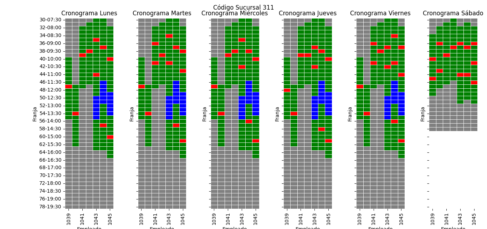
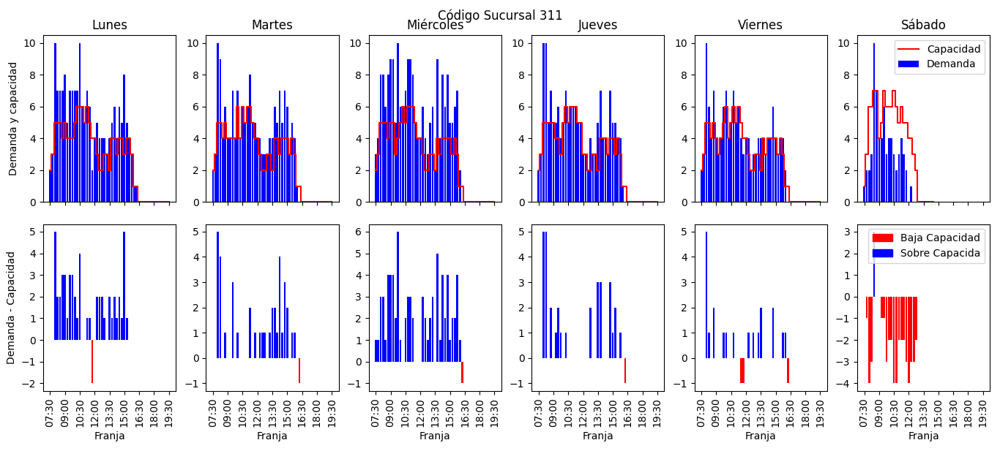
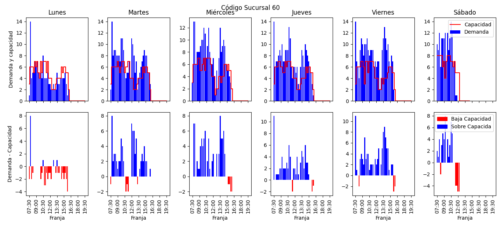
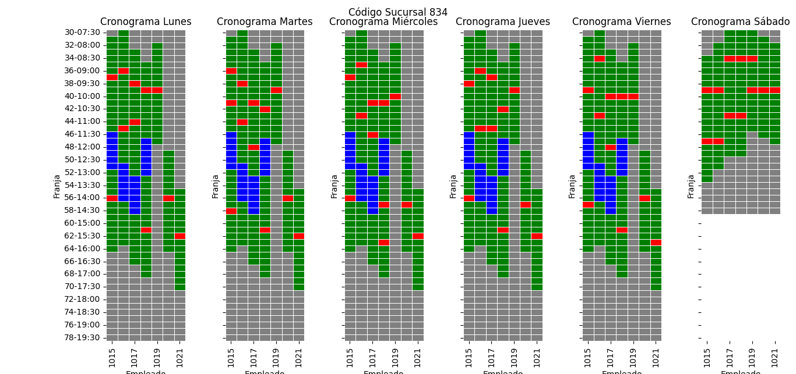
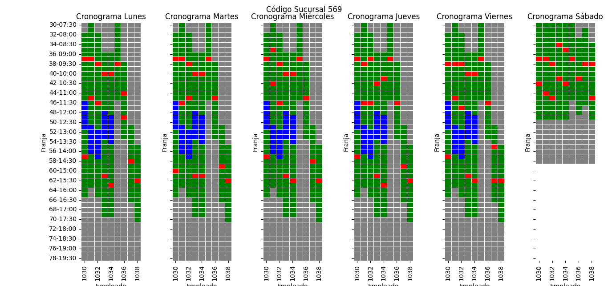

# Breve vista de los resultados

Los resultados se generaron en una máquina con las siguientes especificaciones de hardware: CPU Intel(R) Core(TM) i5-8250U @ 1.60GHz, dotada de 4 procesadores físicos y 8 lógicos, y equipada con 12 GB de RAM. El tiempo total de ejecución fue de 31 minutos.

Utilizando el archivo de entrada `Dataton 2023 Etapa 2.xlsx`, se logró alcanzar un puntaje de **2624**. Este puntaje representa la diferencia entre la demanda y la capacidad, en situaciones donde la demanda supera a la capacidad.

A continuación, se presenta un resumen de las programaciones horarias que fueron obtenidas:

| Sucursal |Programación |
|:----------------------:|:-------------------------:|
| 311| |  |
| 60| |
| 834| |
| 487|  |
| 569|  |